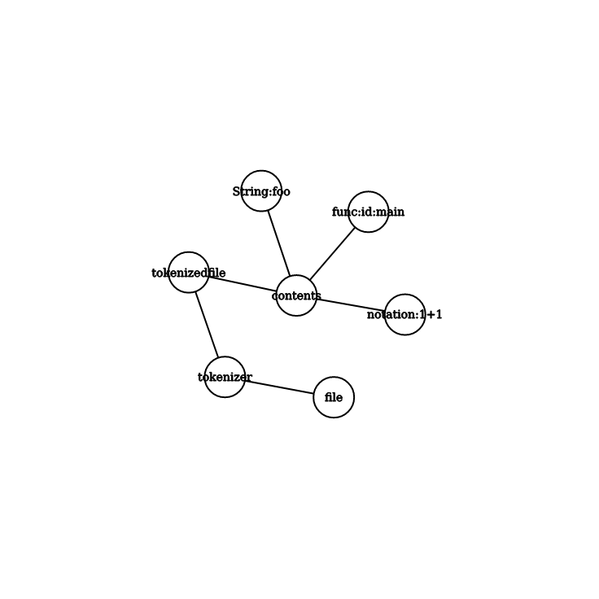

# Tokenization
## How I tokenize

My tokenizing system is simple it reads through the file 

and depending on the current character creates a new token 

of the respecting type.

## Token Types

I currently have 8 token types 

Id

Notation

Int

Literal

Char

Function

String

Return

## A visualisation

